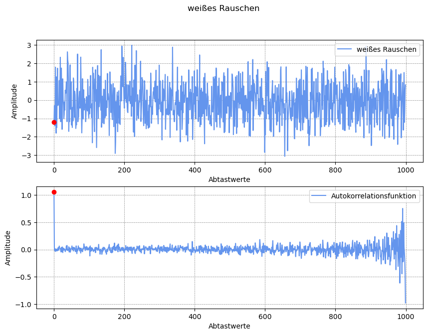

```python
# -*- coding: utf-8 -*-
"""
Created on Fri Sep  1 19:13:41 2023

Program history
15.01.2024    V. 1.0    Start

@author: Prof. Jörg Grabow (grabow@amesys.de)
"""
__version__ = '1.0'
__author__ = 'Joe Grabow'

import numpy as np
import matplotlib.pyplot as plt
```

## Funktionen zur Zeitreihenannalyse

### Autokorrelationsfunktion


```python
def autocorrelation_function(data):
    N = len(data) 
    acf = []
    for k in range(N):
        sum_term = sum(data[i] * data[i - k] for i in range(k, N))
        acf.append(sum_term / (N - k))
    return acf
```

### Funktionen zur Zeitreihenanalyse


```python
# Funktion zur Berechnung einer Sinusfunktion
def sinus_function(x, amplitude, frequency, phase):
    return amplitude * np.sin(2 * np.pi * frequency * x + phase)
```


```python
# weißes Rauschen
def generate_white_noise(N):
    white_noise = np.random.randn(N)
    return white_noise
```

### graphische Darstellung


```python
def plot_time_series_analysis(title, signal, acf):
    fig, axs = plt.subplots(2, 1, figsize=(10, 7))
    fig.suptitle(title)

    axs[0].plot(x_values, signal, '-', color='cornflowerblue', label=title)
    axs[0].legend(loc='upper right')
    axs[0].set_xlabel('Abtastwerte')
    axs[0].set_ylabel('Amplitude')

    axs[1].plot(x_values, acf, '-', color='cornflowerblue', label="Autokorrelationsfunktion")
    axs[1].legend(loc='upper right')
    axs[1].set_xlabel('Abtastwerte')
    axs[1].set_ylabel('Amplitude')

    # Zeige ein Gitternetz im Hintergrund an
    for ax in axs:
        ax.grid(True, color='gray', linestyle='--', linewidth=0.5)

    # Markierung der Abtatswerte bei null
    axs[0].scatter(0, signal[0], color='red', zorder=5)
    axs[1].scatter(0, acf[0], color='red', zorder=5)

    plt.show()
```

### Hauptprogram zur Zeitreihenanalyse


```python
# Testfunktionen erstellen
N = 1000
x_values = np.arange(N)
sinus_wave = sinus_function(x_values, amplitude=3, frequency=0.01, phase=0)
noise = generate_white_noise(N)
sinus_noise = sinus_wave + noise
```

### Darstellung


```python
# Autokorrelationsfunktion berechnen und plotten
acf_sinus_wave = autocorrelation_function(sinus_wave)
plot_time_series_analysis('Sinusfunktion', sinus_wave, acf_sinus_wave)

acf_white_noise = autocorrelation_function(noise)
plot_time_series_analysis('weißes Rauschen', noise, acf_white_noise)

acf_sinus_noise = autocorrelation_function(sinus_noise)
plot_time_series_analysis('Sinus überlagert mit Rauschen', sinus_noise, acf_sinus_noise)

```


    

    


    

    


    

    

